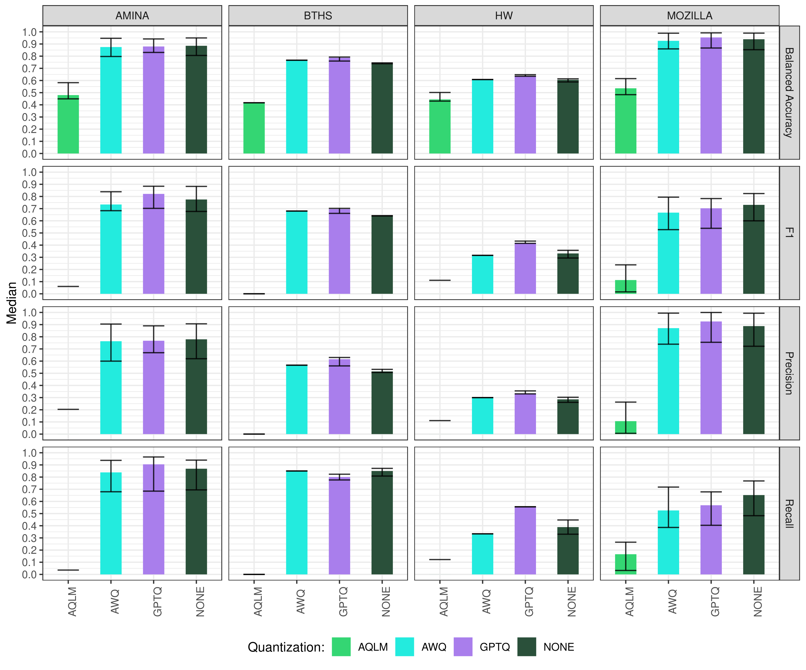
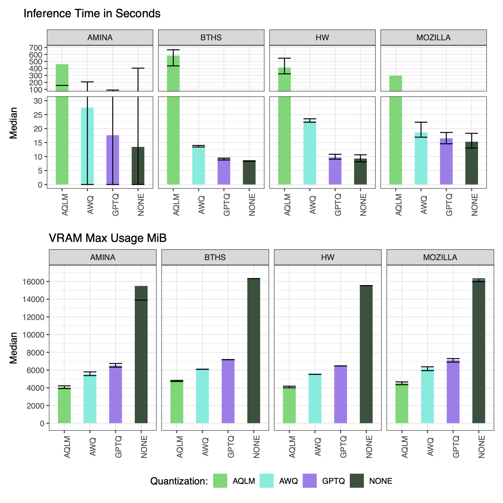

# Cost-Effective Maintenance of Requirements-Test Alignment via Quantized LLMs

## Overview

This study investigates whether **quantized Large Language Models (LLMs)** can
serve as a viable and resource-efficient alternative to full-precision models
for the purpose of aligning software requirements with tests, namely in terms
of automated generation of trace links between them.

We evaluate four variants of **Mistral-7B-Instruct-v0.2** across four
industrial and open-source datasets, measuring both efficacy (quality of trace
links) and efficiency (GPU memory usage and inference speed).

> **Note**: the source code of `RT` tool can be found in [`RT/*`](./RT/). It's
> a fork of [BaoLindgren/REST-at](https://github.com/BaoLindgren/REST-at/).
> (Published at AST'26 Co-located with ICSE)

The `analysis` folder contains the full data analysis pipeline for the study.
Below are some more details about it.

## Experiment Context

The study compares LLM quantization methods across multiple datasets and repeated iterations.

| Dimension     | Values                              |
|---------------|-------------------------------------|
| Model         | MIS (single model)                  |
| Quantization  | `NONE`, `AWQ`, `GPTQ`, `AQLM` |
| Datasets      | `AMINA`, `BTHS`, `HW`, `MOZILLA`   |
| Iterations    | 10 per treatment                    |
| RQ1 metrics   | `balanced_accuracy`, `recall`, `precision`, `f1` |
| RQ2 metrics   | `time_to_analyze`, `vram_max_usage_mib` |

Treatment names follow the convention `{MODEL}_{QUANTIZATION}_{DATASET}` (e.g., `MIS_GPTQ_AMINA`).

## Data Flow

```
../res/  (raw JSON experiment output)
    |
    v
data_preprocessing.ipynb  (via analysis_utils.py)
    - Loads JSON files from nested res/ directory
    - Flattens GPU/VRAM nested fields
    - Converts to long/tidy format
    - Exports tidy CSVs
    |
    v
data/PT6_prompt/*.csv
    |
    +-----> analysis_pipeline.R       --> results/PT6/*_post-hoc_results-*.csv
    |           (Friedman + Wilcoxon + VDA)
    |
    +-----> plotting.r                --> results/*.pdf
    |           (ggplot2 bar + box plots)
    |
    +-----> create_full_results_csv.r --> results/full_summary_table.csv
                (joins RQ1 + RQ2)
```

## Key Files

### `analysis_pipeline.R` — Main Statistical Pipeline

The central analysis script. Controls which RQ to analyze via a single flag at the top:

```r
USE_RQ1 = TRUE   # TRUE -> RQ1 (efficacy), FALSE -> RQ2 (efficiency)
```

**Steps performed:**
1. **Friedman test** — non-parametric repeated-measures NHST; groups by `(model, dataset, metric)`.
2. **Variance filtering** — removes quantization groups with zero variance before post-hoc testing.
3. **Pairwise Wilcoxon signed-rank test** — paired, with Holm-Bonferroni correction for multiple comparisons.
4. **Paired VDA effect size** — custom implementation of the Vargha-Delaney A measure for paired/repeated-measures data (no existing R package covers this case). Magnitude labels: `Negligible / Small / Medium / Large`.
5. **Output** — writes combined post-hoc + effect size results to `results/PT6/rq{1,2}_post-hoc_results-*.csv`.

> Note: A deprecated Wilcoxon-r effect size implementation is preserved at the
> bottom of the file inside `if (FALSE) { ... }` and does not execute.

### `plotting.r` — Visualization

Generates publication-ready PDFs using `ggplot2`. Toggle flags at the top:

```r
USE_RQ1 = TRUE
```

Produces:
- **Bar plots** — median + error bars (mean ± SD) faceted by metric and dataset.
- **Box plots** — distribution + jitter overlay, same faceting.
- RQ2 plots use `ggbreak::scale_y_break()` to handle the large range between VRAM values and time values, and are combined with `patchwork`.

A named colour palette is defined at the top (`CUSTOM_PALLETE`) — edit it here to change plot colours globally.

### `create_full_results_csv.r` — Summary Table Builder

Joins RQ1 and RQ2 data frames and writes
`results/full_summary_table.csv` with `mean` and `SD` per `(quantization,
dataset, metric)`.

### `analysis_utils.py` — Python Data Loading Module

Provides two public functions used by both notebooks:

- **`load_experiment_data(base_dir, iteration_structure=True)`** — walks the `../res/` directory tree and returns three dicts keyed by session name (`{MODEL}_{QUANT}_{DATASET}`):
  - `stat_sum_dfs` — statistical summaries from `<session>.json`
  - `all_data_dfs` — individual measurements from `all_data_<session>.json`
  - `raw_metric_data` — raw metric values including the `population` array (excluded from summary df)
- **`save_dataframe_to_csv(df, dest_path, filename, overwrite=False)`** — safe CSV writer; raises `FileExistsError` if the file exists and `overwrite=False`.

### `data_preprocessing.ipynb` — Preprocessing Notebook

- Loads raw experiment data via `analysis_utils.load_experiment_data()`.
- Flattens nested `GPU` and `VRAM` JSON columns into scalar columns.
- Converts wide data to tidy/long format, separated by RQ.
- Exports the tidy CSVs to `data/`. The export cells are currently commented out or selectively enabled — check before re-running.

### `data_visualization.ipynb` — Visualization Notebook

- Loads the same `../res/` data.
- Plots efficacy metrics vs. sample size (line plots) across models and datasets — useful for understanding how performance scales.

## Reproduce Results

This section describes required steps to *reproduce* results from the paper.
Follow each step carefully. 

1. Run the `eval_iteration.py` script. This generates the `res/` folder output.
2. Run the `data_preprocessing.ipynb` notebook. This creates tidy `.csv`-files for statistical analysis.
3. Open the `analysis/` directory as a project in RStudio.
4. Run `analysis_pipeline.R` to execute the statistical analysis. The flag `USE_RQ1` can be used to swap between outputting RQ1 and RQ2 results.
5. Run `plotting.r` to create the graphs. The flag `USE_RQ1` can be used to swap between outputting RQ1 and RQ2 graphs.

## Appendix

The following sections feature supplementary insights into the analysis part of the article.

### Datasets

#### Dataset Specifications — BTHS & HealthWatcher

| Dataset       | RE | ST | Pos. | Neg. | Prevalence (%) | 1:1 | 1:M | M:1 | N:M | Unassigned |
|---------------|----|----|------|------|----------------|-----|-----|-----|-----|------------|
| BTHS          | 8  | 15 | 20   | 100  | 16.67          | 1:1 | 3:8 | 0:0 | 3:6 | 1          |
| HealthWatcher | 9  | 9  | 9    | 72   | 11.11          | 9:9 | 0:0 | 0:0 | 0:0 | 0          |

#### Dataset Specifications — AMINA (sample = 25)

| Sample | RE | ST | Pos. | Neg. | Prevalence (%) | 1:1   | 1:M   | M:1 | N:M | Unassigned |
|--------|----|----|------|------|----------------|-------|-------|-----|-----|------------|
| 01     | 25 | 40 | 41   | 959  | 4.10           | 18:18 | 5:20  | 1:1 | 1:2 | 0          |
| 02     | 25 | 31 | 31   | 744  | 4.00           | 19:19 | 6:12  | 0:0 | 0:0 | 0          |
| 03     | 25 | 38 | 39   | 911  | 4.11           | 19:19 | 4:17  | 1:1 | 1:2 | 0          |
| 04     | 25 | 31 | 31   | 744  | 4.00           | 20:20 | 5:11  | 0:0 | 0:0 | 0          |
| 05     | 25 | 31 | 31   | 744  | 4.00           | 20:20 | 5:11  | 0:0 | 0:0 | 0          |
| 06     | 25 | 30 | 30   | 720  | 4.00           | 21:21 | 4:9   | 0:0 | 0:0 | 0          |
| 07     | 25 | 37 | 37   | 888  | 4.00           | 22:22 | 3:15  | 0:0 | 0:0 | 0          |
| 08     | 25 | 39 | 39   | 936  | 4.00           | 20:20 | 5:19  | 0:0 | 0:0 | 0          |
| 09     | 25 | 30 | 31   | 719  | 4.13           | 19:19 | 4:9   | 1:1 | 1:2 | 0          |
| 10     | 25 | 32 | 32   | 768  | 4.00           | 18:18 | 7:14  | 0:0 | 0:0 | 0          |

#### Dataset Specifications — Mozilla (sample = 25)

| Sample | RE | ST | Pos. | Neg. | Prevalence (%) | 1:1   | 1:M | M:1 | N:M | Unassigned |
|--------|----|----|------|------|----------------|-------|-----|-----|-----|------------|
| 01     | 25 | 25 | 25   | 600  | 4.00           | 25:25 | 0:0 | 0:0 | 0:0 | 0          |
| 02     | 25 | 21 | 21   | 504  | 4.00           | 21:21 | 0:0 | 0:0 | 0:0 | 4          |
| 03     | 25 | 20 | 20   | 480  | 4.00           | 20:20 | 0:0 | 0:0 | 0:0 | 5          |
| 04     | 25 | 20 | 20   | 480  | 4.00           | 20:20 | 0:0 | 0:0 | 0:0 | 5          |
| 05     | 25 | 23 | 23   | 552  | 4.00           | 23:23 | 0:0 | 0:0 | 0:0 | 2          |
| 06     | 25 | 23 | 23   | 552  | 4.00           | 23:23 | 0:0 | 0:0 | 0:0 | 2          |
| 07     | 25 | 22 | 22   | 528  | 4.00           | 22:22 | 0:0 | 0:0 | 0:0 | 3          |
| 08     | 25 | 21 | 21   | 504  | 4.00           | 21:21 | 0:0 | 0:0 | 0:0 | 4          |
| 09     | 25 | 18 | 18   | 432  | 4.00           | 18:18 | 0:0 | 0:0 | 0:0 | 7          |
| 10     | 25 | 19 | 19   | 456  | 4.00           | 19:19 | 0:0 | 0:0 | 0:0 | 6          |

#### Full Dataset Character Distribution (avg. characters per field)

| Dataset       | RE  | ST  | Feature | Description | Purpose | Test Steps | Avg. Prompt Length |
|---------------|-----|-----|---------|-------------|---------|------------|--------------------|
| AMINA         | 100 | 130 | 27.54   | 153.32      | 32.59   | 172.12     | 6,291              |
| BTHS          | 8   | 15  | 33.75   | 487.50      | 103.67  | 677.80     | 13,235             |
| Mozilla       | 316 | 254 | 18.92   | 81.41       | 103.34  | 663.65     | 20,268             |
| HealthWatcher | 9   | 9   | 16.89   | 177.44      | 0       | 996.78     | 10,157             |

> The average prompt length is calculated as: fixed prompt template length + average requirement string length + (number of tests x average test string length).

**Key observation**: Mozilla has the longest average prompt length (20,268 chars), driven by its large artifact count and verbose test steps — this directly correlates with the higher inference times observed for that dataset.

### Dataset Examples

Below are representative examples of requirement-to-test mappings from each dataset.

<summary>AMINA</summary>

<details>

**RE:** B62 — *Energy values to other system within 10 sec*
The energy values (15-minute values) shall be exportable from HES via integrations to other systems within 10 seconds after registration in HES.

**ST:** 194 — *Energy values to other system within 10 sec*
Verify that the goods are delivered from HES according to the agreed export interval.

**Mapping:** B62 → 194
**RE:** B107 — *Version control of web service interfaces*
Web service interfaces should be version controlled so that old versions can be used if necessary.

**ST:** 25 — *Version control of web service interfaces*
Verify that the previous version of the web service interface can be read back and is compatible with the new or previous version of ACM.

**Mapping:** B107 → 25

</details>

<summary>BTHS</summary>

<details>

**RE:** 4.6.1 — *Audio Connection Transfer from AG to HS*
The audio connection transfer from AG to HS is initiated by a user action on the HS side. To effect this transfer, the HS shall send the AT+CKPD=200 command to the AG.

**ST:** HSP/AG/ACT/BV-01-I
To verify that the AG can perform an audio connection transfer from AG to HS initiated by a user action on the headset.
*Procedure*: HS initiates user action (e.g. press button); AG: no action required.
*Expected Outcome*: The user action on the HS transfers the audio connection from AG to HS.

**Mapping:** 4.6.1 → HSP/AG/ACT/BV-01-I

</details>

<summary>HealthWatcher</summary>

<details>

**RE:** FR15 — *Update health unit*
This use case allows the health unit's data to be updated.

**ST:** T-8
Steps include: selecting the update option, retrieving the health unit list, selecting a unit, fetching its data, editing the data, and storing the updated information consistently.

**Mapping:** FR15 → T-8

</details>

<summary>Mozilla</summary>

<details>

**RE:** R-005
Double-clicking on a bookmark shall cause it to be launched in a browser window.

**ST:** TC-005
Steps include: selecting a bookmark from the Bookmarks menu, the toolbar, the sidebar panel, or the Bookmarks manager, and double-clicking it.
*Expected result*: The URL corresponding to the selected bookmark loads in the browser window.

**Mapping:** R-005 → TC-005

</details>

### Analysis Supplementary Material — Box Plots

Box plots illustrating the distribution of efficacy (RQ1) and efficiency (RQ2) metrics across all datasets and model treatments are provided in the full paper.

- **RQ1 box plots**: Show treatment-level distributions of balanced accuracy, precision, recall, and F1-score across AMINA, BTHS, Mozilla, and HealthWatcher.
- **RQ2 box plots**: Show treatment-level distributions of inference time and maximum VRAM usage across all datasets.




**Key observation**: AQLM exhibits the widest variance in both inference time and VRAM (due to its tendency to enter token-generation loops), while GPTQ shows tight, consistent distributions — reinforcing its reliability as an alternative to the full-precision model.

### Post-hoc Results for RQ1 and RQ2

Post-hoc analyses were conducted using the **paired Vargha and Delaney A (VDA)** effect size statistic and adjusted p-values following Kruskal-Wallis tests where a significant difference was detected across treatments.

Full post-hoc tables are provided per dataset for both RQ1 (efficacy metrics) and RQ2 (efficiency metrics).

**Key observations**:

- **GPTQ vs. None (full-precision)**: In most datasets and metrics, pairwise comparisons yield non-significant p-values or near-0.5 VDA scores, confirming GPTQ performs on par with the full-precision model.
- **AQLM vs. others**: Consistently shows extreme VDA scores (near 0.0 for efficacy metrics), confirming catastrophic degradation from aggressive 2-bit quantization.
- **VRAM (RQ2)**: All quantized models receive VDA scores of 0.0 in every comparison with the full-precision model, confirming a statistically significant and large reduction in VRAM for all quantization methods.
- **Inference time (RQ2)**: The full-precision model is the fastest; AWQ is notably slower than GPTQ (VDA = 1.0, large effect), though both complete within practical time bounds for the tested dataset sizes.

### RQ3 Supplementary Material

#### Linearithmic Fit Detection Algorithm

To test whether inference time scales linearithmically (i.e., proportional to *n* log *n*) with input artifact size, a linear regression is applied to the transformed variable *z = x · log(x)*, where *x* is the number of input artifacts.

**Algorithm outline:**
1. Transform input: *z_i = x_i · log(x_i)*
2. Compute OLS slope *a* and intercept *b* on the transformed variable
3. Compute fitted values and the coefficient of determination *R²*

#### R² Scores for Linearithmic Fit

| Model | Dataset | R²     |
|-------|---------|--------|
| GPTQ  | Mozilla | 0.9656 |
| None  | Mozilla | 0.9655 |
| GPTQ  | AMINA   | 0.9825 |
| None  | AMINA   | 0.9840 |

**Key observations**:

- R² values above 0.96 confirm a **strong linearithmic relationship** between input artifact size and inference time — inference time does not grow linearly, but at a slightly faster-than-linear (yet sub-quadratic) rate.
- **Quantization does not alter the scaling law**: GPTQ and the full-precision model exhibit nearly identical R² values and overlapping inference time curves, meaning quantization reduces absolute VRAM costs but does not reduce the rate at which inference time grows with input size.
- **Efficacy degrades with size**: As sample size increases, recall and F1-score show **severe degradation**, while accuracy and balanced accuracy remain relatively stable. Models become increasingly conservative with larger inputs, avoiding false positives at the cost of missing true positives.
- **Practical implication**: Practitioners should apply **input truncation** or **summarization** to minimize artifact size, particularly when low latency and high recall are both required.

### R Implementation of the Paired Vargha and Delaney A (VDA) Effect Size

#### Background

Vargha and Delaney's A (VDA) is a nonparametric effect size statistic that estimates the probability that a randomly selected observation from group A exceeds one from group B. It is well-suited for ordinal or non-normally distributed data and complements significance tests.

#### Why a Custom Paired Implementation?

Existing implementations (e.g., `VD.A()` in the R `effsize` package) assume **independent samples** and perform all possible pairwise cross-comparisons. Our experiment uses a **within-subject (paired) design** where each model treatment is applied to the same dataset sample in the same iteration. Applying an independent-samples VDA to paired data is statistically invalid, and no existing R or Python package provides a built-in paired VDA implementation.

#### Formula

The paired VDA statistic is defined as:

```
A_paired = ( #(A > B) + 0.5 · #(A = B) ) / n
```

Where:
- `#(A > B)` = number of paired observations where group A outperforms B
- `#(A = B)` = number of ties
- `n` = total number of paired comparisons

The result ranges from **[0, 1]**:
- **0.5** — no effect (groups are equivalent)
- **> 0.5** — group A tends to dominate group B
- **< 0.5** — group B tends to dominate group A

#### Theoretical Basis

This formula combines two complementary frameworks:

- **Kerby's simple difference formula** (`r = f - u`): a nonparametric correlation expressing the directional difference between favorable (`f`) and unfavorable (`u`) paired outcomes, ranging from [−1, 1].
- **Vargha and Delaney's probabilistic estimator**: reframes the same comparison as a probability of dominance in [0, 1], adding a half-tie convention for robustness.

The paired VDA formula is a direct extension of Kerby's framework into a probability-based effect size suited for dependent data.

#### Effect Size Thresholds (Vargha & Delaney)

| A_paired value | Interpretation    |
|----------------|-------------------|
| >= 0.71        | Large effect      |
| >= 0.64        | Medium effect     |
| >= 0.56        | Small effect      |
| ~  0.50        | Negligible effect |

#### Implementation

The custom `run_paired_vda()` function in R matches observations by iteration index to ensure correct pairing, then computes the A_paired value and its categorical label for each treatment pair.

Source code is available in the project repository:
[`analysis/analysis_pipeline.R`](https://github.com/Q-REST-at/Q-REST-at/blob/main/analysis/analysis_pipeline.R)
